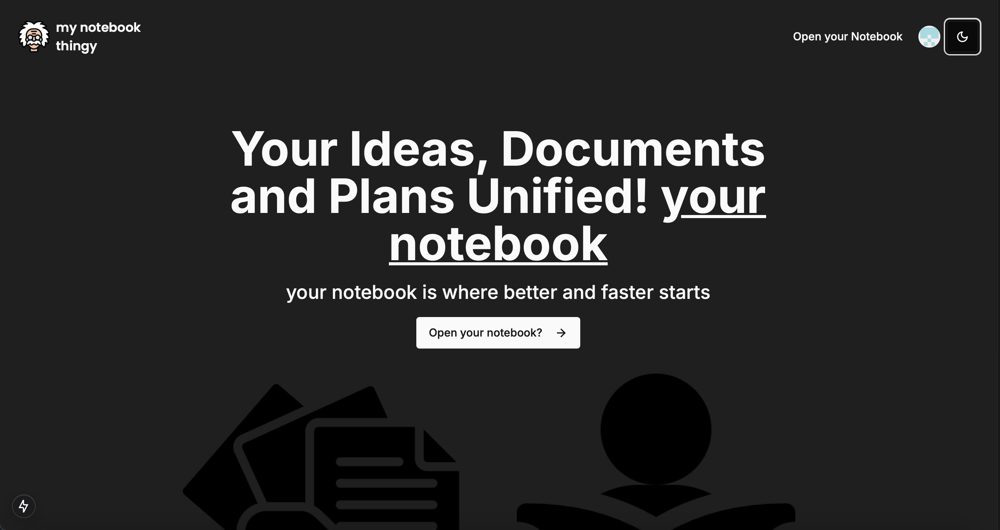
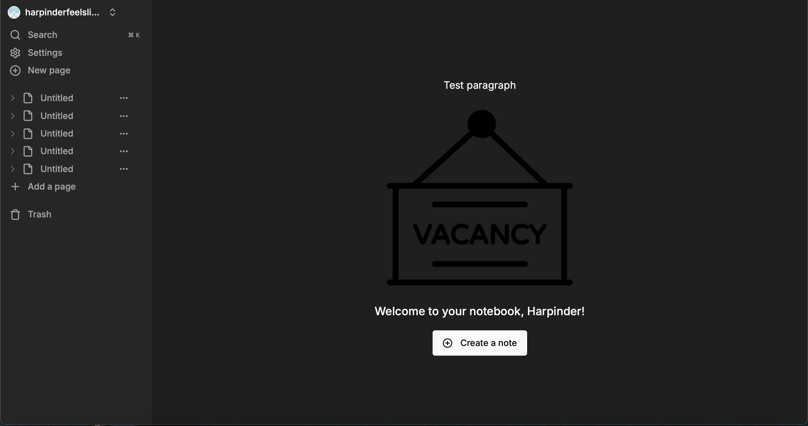
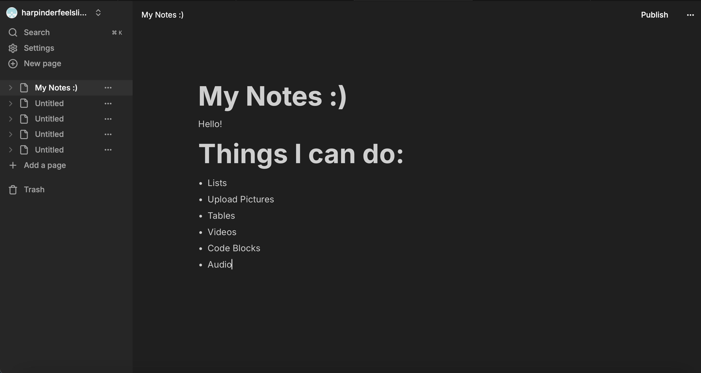

# Note-Taking-Thing


A modern note-taking application built with **Next.js**, **React**, **TypeScript**, **shadcn/ui**, **Sonner**, **Tailwind CSS**, **BlockNote**, **Clerk** APIs, **Convex**, and **Edge Store**.

This project was previously deployed on **Vercel** for demonstration purposes.



This is the landing page where you will see before you log in.



This is what you will see when you log in.



This is all you can do! I modeled it after Notion. I was sick and tired of paying to have to take notes, feel free to fork!


## Table of Contents

1. [Overview](#overview)  
2. [Features](#features)  
3. [Tech Stack](#tech-stack)  
4. [Prerequisites](#prerequisites)  
5. [Getting Started](#getting-started)  
6. [Project Structure](#project-structure)  
7. [Configuration](#configuration)  
8. [Usage](#usage)  
9. [Deployment](#deployment)  
10. [Contributing](#contributing)  
11. [License](#license)

---

## Overview

This note-taking application is designed to showcase a modern, full-stack web app powered by a cutting-edge toolkit. It leverages **Next.js** for server rendering and routing, **React** for the UI, **TypeScript** for static typing, and **Convex** as the backend data layer. **BlockNote** provides a rich text editing experience, while **Clerk** handles authentication and user management.

**Key Highlights**:
- User-friendly rich text editor (BlockNote)
- Real-time data synchronization (Convex and Edge Store)
- Simplified authentication using Clerk
- Toast notifications via Sonner/shadcn

---

## Features

1. **User Authentication**  
   - Secure login and registration using **Clerk**.  
   - User session management across pages.

2. **Rich Text Editing**  
   - **BlockNote** for a modern, block-based note editor.  
   - Auto-saving and real-time preview of content.

3. **Notifications**  
   - Toast messages using **Sonner** and **shadcn** for user feedback (success, error, etc.).

4. **Scalable Data Layer**  
   - **Convex** for backend logic and database queries.  
   - **Edge Store** to handle data storage in a serverless environment.

5. **Responsive UI**  
   - Built with **Tailwind CSS**, ensuring a mobile-friendly and visually appealing interface.

---

## Tech Stack

- **Frontend**: [React.js](https://reactjs.org/), [Next.js](https://nextjs.org/), [TypeScript](https://www.typescriptlang.org/), [Tailwind CSS](https://tailwindcss.com/), [BlockNote](https://blocknote.dev/), [shadcn/ui](https://ui.shadcn.com/)
- **Notifications**: [Sonner](https://sonner.dev/)
- **Authentication**: [Clerk](https://clerk.com/)
- **Backend**: [Convex](https://convex.dev/)
- **Database / Data Storage**: [Convex Database](https://docs.convex.dev/) and [Edge Store](https://docs.convex.dev/database/edge-store)
- **Deployment**: [Vercel](https://vercel.com/) (previously deployed)

---

## Prerequisites

- **Node.js** (version 16+ recommended)
- **npm** or **yarn**
- An account for **Clerk** (for authentication)
- A **Convex** project set up (if you want to use your own Convex instance)

---

## Getting Started

1. **Clone the repository**:
   ```bash
   git clone https://github.com/yourusername/note-taking-app.git
   cd note-taking-app
   ```
2. **Install dependencies**:
npm install
# or
yarn install

3. **Configure the environment variables in a .env file**:
See below

4. **Make sure you are in the correct environment**:
You should have to cd into the smaller 'note taking thing' directory.

5.**Start the development server**:
npm run dev
# or
yarn dev

## Configuration
You’ll need to set up some environment variables to run this application properly. Create a file named .env.local in the root directory and add the following (as an example—actual keys may vary):
# Clerk
NEXT_PUBLIC_CLERK_PUBLISHABLE_KEY=your_clerk_publishable_key
CLERK_SECRET_KEY=your_clerk_secret_key

# Convex
CONVEX_URL=your_convex_project_url

# (Any additional variables if needed)
Replace your_clerk_publishable_key, your_clerk_secret_key, and your_convex_project_url with the actual credentials from your Clerk and Convex dashboards.

## Usage

1. Sign In / Sign Up
Upon visiting the app, users can sign up or log in using the Clerk-powered authentication flow.
2. Creating & Editing Notes
After logging in, you can create new notes using the BlockNote editor.
Notes support rich text formatting (headings, bold, italics, etc.).
3. Toast Notifications
Feedback (success or error) is presented using Sonner. For instance, saving a note or encountering an error triggers a toast.
4. Real-Time Updates
Notes are stored in Convex with Edge Store for real-time data and quick reads.
Changes appear automatically without requiring a page refresh.

## Contributing

Contributions, issues, and feature requests are welcome!
Feel free to check the Issues page to see if there's something you can help with.
Fork the Project
Create your Feature Branch (git checkout -b feature/AmazingFeature)
Commit your Changes (git commit -m 'Add some AmazingFeature')
Push to the Branch (git push origin feature/AmazingFeature)
Open a Pull Request

## License

This project is licensed under the MIT License.
You are free to use, modify, and distribute this software however you see fit, as long as this license is included.
